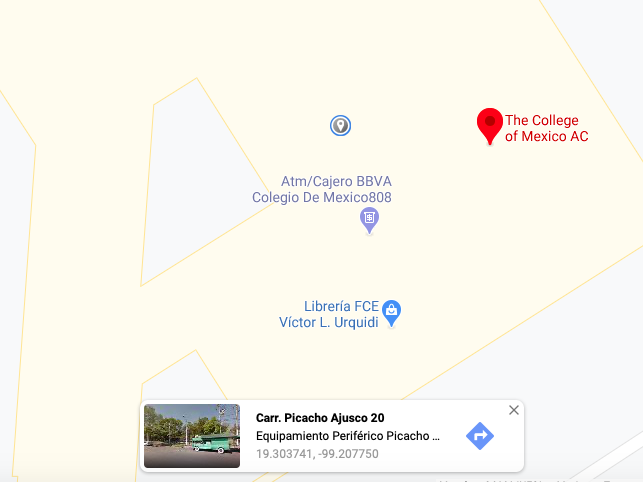

```{r setup, include=FALSE}
knitr::opts_chunk$set(echo = TRUE)
```

La semana pasada, mientras estaba yo muy a gusto en mi trabajo limpiando bases de datos, un amigo mío muy querido (y aparte, mi ex-jefe) Jesús Carrillo [@ProfeTriste](https://twitter.com/ProfeTriste) me lanzó el siguiente reto: 


Y pues bueno, al terminar la jornada laboral (obviamente) me dediqué a resolver este reto (porque, si bien tenía la idea, nunca lo había realizado).

## Paso 1. Descargar la información. 

Primero había que descargar la información de la frontera norte de México a mi computadora. La primera opción que pensé hacer fué filtrar las líneas superiores de un shape de los estados del país, pero si lo piensas un poco... ¿como podría decirle a R cual es la línea superior de un estado? ¿Seleccionando los puntos más extremos en el eje Y?

Pues tal vez esa podría ser una opción, pero el algoritmo de Googlear la base y descargar la base resultó más efectivo. 

Si eres de los que les dá flojera ir a la página, descargar archivos, ir a la carpeta de _Descargas_, y mover el archivo a la carpeta de trabajo, puedes utilizar el código de abajo (obviamente, descargando primero el paquete `curl` del CRAN).

```{r, message=FALSE, cache=FALSE,warning=FALSE}
# Descarga datos automaticamente, si te da flojera darle cl
curl::curl_download("https://opendata.arcgis.com/datasets/e735940321bd4383bab528a91bf526f8_0.zip?outSR=%7B%22latestWkid%22%3A3857%2C%22wkid%22%3A102100%7D",
destfile = "frontera.zip")
```

Esto me descargó un archivo `*.zip`, que yo nombré como `frontera.zip`, en mi directorio de trabajo. Como ya caducó mi licencia de WinRar 😔 y no puedo descomprimirlo en la computadora, utilizo el siguiente código para extraer la información: 

```{r, message=FALSE, cache=FALSE,warning=FALSE}
# Deszipeado
unzip(zipfile = "frontera.zip")
```

Una vez descomprimido, tengo ahora un montón de archivos en mi directorio de trabajo llamados `Mexico_and_US_Border` con distintas extensiones, tales como `*.shp`, `*.shx` o `*.dbf`. Estos archivos son la manera en que se guardan las bases de datos geográficas (formato `shapefile`), y estos archivos se pueden abrir desde R con la librería `sf`.

## Paso 2. Abriendo los datos. 

Para abrir la base de datos de la frontera norte, usamos la función `sf::st_read()` como se ve a continuación: 

```{r, message=FALSE, cache=FALSE,warning=FALSE}
# Librerias
library(sf)
library(tidyverse)
# Apertura del archivo (solo abrimos el archivo *.shp)
f <- st_read("Mexico_and_US_Border.shp")
```

Y ya. así lo abrimos. Para corroborar que sea efectivamente un archivo geográfico, lo ploteamos (dibujamos): 

```{r, message=FALSE, cache=FALSE,warning=FALSE}
# Ploteado (te recomiendo que no le muevas al max.plot = 1)
plot(f, max.plot = 1)
```

## 3. Definiendo el punto. 

Ahora hay que determinar el punto al cual le vamos a sacar la distancia respecto de la frontera norte: como mi amigo es estudiante del Colmex, vamos a calcular la distancia de El Colegio de México a un punto (el más cercano) a la frontera norte.

Para sacar las coordenadas del Colmex, lo buscamos en Google Maps, y le picamos encima de la biblioteca para sacar sus coordenadas: 



Ahora, creamos una tabla que almacene estas coordenadas latitud/longitud: 

```{r, message=FALSE, cache=FALSE,warning=FALSE}
# Las coordenadas del Colmex en formato tabla-dataframe
pto <- data.frame(x = -99.20775, y = 19.303741) %>% 
  st_as_sf(coords = c("x", "y")) 

# Homologamos el Sistema de Coordenadas de Referencia con la base de la línea de la Frontera Norte
st_crs(pto) <- st_crs(f)
```

## 4. Calculamos la distancia. 

Ahora calculamos la distancia. 

```{r, message=FALSE, cache=FALSE,warning=FALSE}
st_distance(pto, f) 
```

Y si, la distancia de El Colmex a el punto más cercano de la frontera norte (quién sabe cual) es de 746.6889 km ( _746688.9_ m). 

Y ahí está la respuesta a la distancia. **Fin**. 

## 5. ¿A qué punto se calculó la distancia? 

Pero ahora pueden surgir preguntas muy lógicas sobre esta respuesta... _¿Qué método utiliza R para calcular esta distancia?_, _¿A qué punto de la frontera se le calculó la distancia?_ 

Entonces, hagamos el cálculo más detenidamente, para esto, propongo descomponer la línea de la frontera norte en sus vértices: 

```{r, message=FALSE, cache=FALSE,warning=FALSE}
# Descomponemos la linea en sus coordenadas
ptos_linea <- st_coordinates(f) %>%
  as.data.frame() %>%
  st_as_sf(coords = c("X", "Y")) 

st_crs(ptos_linea) <- st_crs(f)

class(ptos_linea)
st_crs(ptos_linea)
```

Y ahora calculamos las distancias del Colmex a todos los vértices de la frontera norte: 

```{r, message=FALSE, cache=FALSE,warning=FALSE}
distancias <- st_distance(ptos_linea, pto)
head(distancias)
```

Y ahora, sacamos la línea con la menor longitud: 

```{r, message=FALSE, cache=FALSE,warning=FALSE}
# Obtencion de la distancia minima
distancia_minima <- min(distancias) 

# En kilometros
(distancia_minima / 1000) %>% as.numeric()
```

Como podemos ver, la distancia mínima es la misma distancia que calcula la función `st_distance()`. Ahora, ¿cuál punto de todos esos es el punto más cercano al Colmex? Para esto, filtramos las distancias hasta quedarnos aquella observación que tenga la distancia igual a la distancia mínima. 

```{r, message=FALSE, cache=FALSE,warning=FALSE}
# Punto minimo
punto_frontera <- 
  ptos_linea[distancias == distancia_minima,]
```

Y para visualizarlo, creamos una línea que va del Colmex a dicho punto: 

```{r, message=FALSE, cache=FALSE,warning=FALSE}
# linea de distancia
linea <- st_linestring(matrix(c(pto[,"geometry"] %>% 
                              st_coordinates(), 
                              punto_frontera[,"geometry"] %>% st_coordinates()), ncol = 2, byrow = TRUE))
```

Y lo hacemos en un mapa: 

```{r, message=FALSE, cache=FALSE,warning=FALSE}
library(leaflet)

# Hacemos el mapa 
leaflet() %>% 
  addTiles() %>% 
  addCircleMarkers(data = pto) %>% 
  addCircleMarkers(data = punto_frontera) %>% 
  addPolylines(data = linea) %>% 
  addPolylines(data = f, color = "red")
```

Y resulta (haciendo zoom podemos darnos cuenta) que el punto más cercano a la frontera norte se encuentra unos kilómetros al Este de la Ciudad de Matamoros, en el Estado de Tamaulipas. 

## 6. ¿Y si quiero calcular la distancia a otro punto? 

Para hacerlo para cualquier punto de México, hacemos una función. Las funciones son pedazos de código que, entre otras cosas, se programan para llevar a cabo tareas repetitivas (como todo lo que hicimos arriba). Primero, empezaremos haciendo una función para calcular solamente las distancias a la frontera. 

```{r, message=FALSE, cache=FALSE,warning=FALSE}
# Función para calcular las distancias. 
distancia <- function(X, Y){
  pto <- data.frame(x = X, y = Y) %>% 
          st_as_sf(coords = c("x", "y")) 
        st_crs(pto) <- st_crs(f)
  st_distance(pto, f)       
}

# Distancia a un punto del mpio de Mexicali, BC
distancia(X = -115.418556, Y = 31.795112)

# Distancia a Puerto Peñasco, Sonora
distancia(X = -113.534104, Y = 31.309766)

# Distancia al CIDE
distancia(X = -99.263426, Y = 19.374515)

# Distancias a todos estos puntos 
distancia(X = c(-115.418556,-113.534104, -99.263426), 
          Y = c(31.795112, 31.309766, 19.374515))

```

## 7. ¿Y la trayectoria? 

Y ahora, haremos otra función para dibujar las líneas. Esta función va a empaquetar todos los pasos que seguímos para determinar el punto de la frontera al cual llegaba la línea con la distancia mínima. 

```{r, message=FALSE, cache=FALSE,warning=FALSE}

# Funcion para dibujar las lineas de minima distancia
# Nota, esta función asume que previamente ya cargamos 
# la base de datos de la frontera y la almacenamos en el objeto f
dibuja_lineas_minima_distancia <- function(X,Y){

  # Creamos el punto a partir de los argumentos X y Y
  pto <- data.frame(x = X, y = Y) %>% 
        st_as_sf(coords = c("x", "y")) 

  # Homologamos el Sistema de Coordenadas de Referencia
  st_crs(pto) <- st_crs(f)
  
  # Extraemos los vértices de la linea
  ptos_linea <- st_coordinates(f) %>%
    as.data.frame() %>%
    st_as_sf(coords = c("X", "Y")) 
  
  # Homologamos el Sistema de Coordenadas de Referencia
  st_crs(ptos_linea) <- st_crs(f)

  # Sacamos las distancias del punto a todos los vertices de la frontera
  distancias <- st_distance(ptos_linea, pto)

  # Obtencion de la distancia minima
  distancia_minima <- min(distancias) 

  # Guardamos el punto de la frontera con la distancia minima
  punto_frontera <<- 
    ptos_linea[distancias == distancia_minima,]

  # Construimos la linea de distancia minima
  linea <- st_linestring(matrix(c(pto[,"geometry"] %>% 
                                st_coordinates(), 
                                punto_frontera[,"geometry"] %>%       st_coordinates()), ncol = 2, byrow = TRUE))  
  
  # Seleccionamos la linea como objeto a retornar de la funcion 
  return(linea)
  
}

# Probamos la funcion, sacando la linea del CIDE a la frontera
lineaCIDE <- dibuja_lineas_minima_distancia(X = -99.263426, Y = 19.374515)
class(lineaCIDE)
leaflet(lineaCIDE) %>% addTiles() %>% addPolylines(color = "#005700")

```

Pues ahora tenemos una función que nos calcula la distancia y las líneas. Ahora, a partir de estas funciones, cualquier programador experimentado de R puede calcular las distancias y la trayectoria en línea recta a la frontera a partir de solo tener las coordenadas `X` y `Y` del punto de interés, y copipegando las funciones de arriba en su sesión de RStudio.  

## 8. ¿Y si hacemos un shiny?  

Bueno, y ¿si hacemos una solución en la cual cualquier usuario pueda calcular la distancia de cualquier punto a la frontera sur de Estados Unidos? Esto lo vamos a lograr con la librería `shiny` y pegando todo el código que hemos hecho arriba. 

```{r, message=FALSE, cache=FALSE,warning=FALSE}
knitr::include_app("https://lnppmicrositio.shinyapps.io/distanciaAFrontera/")
```
