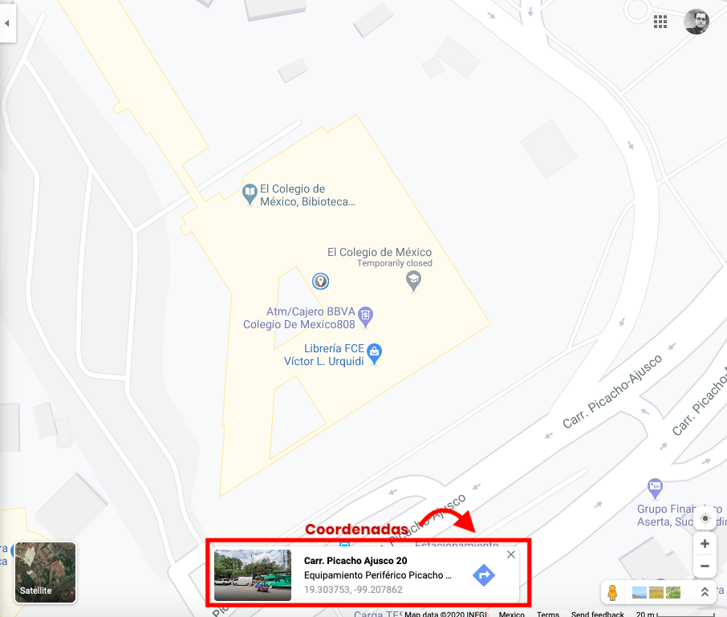
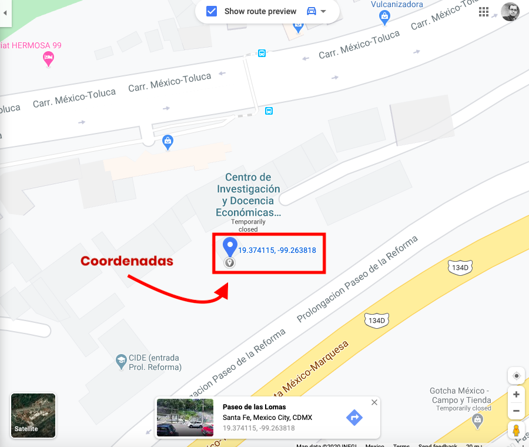
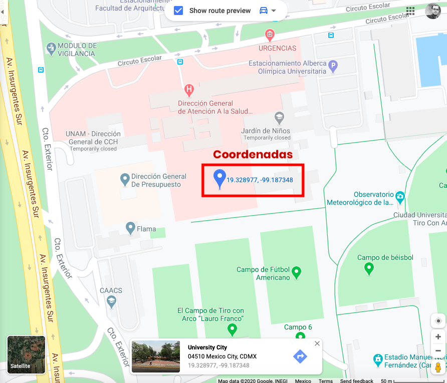
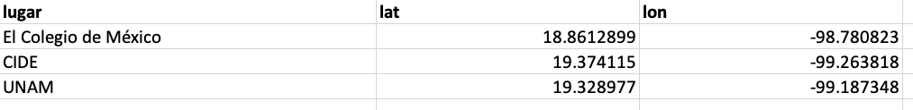

```{r setup, include=FALSE}
knitr::opts_chunk$set(echo = TRUE)
```

## Georreferenciación de puntos en un mapa. 

Para georreferenciar puntos en un mapa (a mi estilo), hay una forma muy sencilla de hacerlo: 

**Paso 1. ** Tener idea de que puntos queremos georreferenciar.

Para este ejemplo vamos a referenciar los puntos de tres escuelas muy importantes de la Ciudad de México: _El Colegio de México_, El _CIDE_ y la _UNAM_. 

**Paso 2. ** Buscar las coordenadas de los puntos. 

Bajo un sistema de coordenadas latitud/longitud con coordenadas decimales (ojo, no grados-minutos-segundos, sino grados, punto y decimales), generamos en excel una tabla con los siguientes datos: 

* Una columna para el nombre del lugar (en este caso, le llamaremos `lugar`).

* Una columna para la para la latitud (coordenada `Y`), que en este caso llamaremos `lat`. 

* Una columna para la longitud (coordenada `X`), que en este caso llamaremos `lon`.


**Paso 3. ** Conseguimos las coordenadas

Para conseguir las coordenadas, abrimos nuestro _Google Maps_, y buscamos los lugares de interés. Una vez encontrados, les damos doble click para desplegar las coordenadas en el formato que definimos antes (latitud y longitud con puntos decimales).

{width=500px}

<b style = 'color:gray; text-align:center;'>Fig. 1: Coordenadas del Colmex</b>

{width=500px}

<b style = 'color:gray; text-align:center;'>Fig. 2: Coordenadas del CIDE</b>


{width=500px}

<b style = 'color:gray; text-align:centered;'>Fig. 3: Coordenadas de la UNAM</b>

Una vez que tenemos estos datos, los incluímos en nuestra hoja de excel, y guardamos el archivo.



**Paso 4. ** Abrir los archivos en RStudio y convertirlos en una base de datos geográfica. 

Para este paso, abrimos el archivo de coordenadas como se muestra a continuación: 

```{r message=FALSE, cache=FALSE, warning=FALSE}
# Librerias ----
library(readxl)    # Leer exceles
library(tidyverse) # Manejar datos
library(sf)        # Manejar datos geograficos

# Abrimos datos ----
escuelas <- read_xlsx("coords.xlsx")

# Vemos que tipo de base es
class(escuelas)

```

Ya abierto el excel, vemos que este no es un archivo geografico, sino que R lo considera como una `tibble` común y corriente. Para que este la considere como una base de datos geográfica, haremos lo siguiente: 

```{r}

# Convertimos a base de datos geografica
escuelas <- escuelas %>% 
  st_as_sf(coords = c("lon", "lat"))

# Corroboramos analizando la clase
class(escuelas)

```

Al tener la clase `sf`, podemos ver que ya se considera como una base de datos geográfica. 

Una vez hecho esto, graficamos la base `escuelas` en un mapa: 

```{r}
# Mi libreria favorita de R para hacer mapas :3
library(leaflet)

# Creacion del mapa
escuelas %>% 
  leaflet() %>% 
  addTiles() %>% 
  addCircleMarkers(color = "black") %>% 
  addPopups(popup = escuelas$lugar, 
            options =  popupOptions(closeButton = FALSE))

```

Y de esta manera se georreferencian puntos de interés en un mapa. Hay formas de hacer este proceso de manera más rápida utilizando APIs de **Google maps** para agilizar la busqueda de coordenadas tan solo con el nombre o la dirección del lugar de interés, pero eso escapa del propósito de este mini-tutorial. En caso de querer revisar este método, puedes acudir a estos enlaces: 

* https://www.shanelynn.ie/massive-geocoding-with-r-and-google-maps/

* https://www.storybench.org/geocode-csv-addresses-r/

* https://rpubs.com/blentley/geocoding


