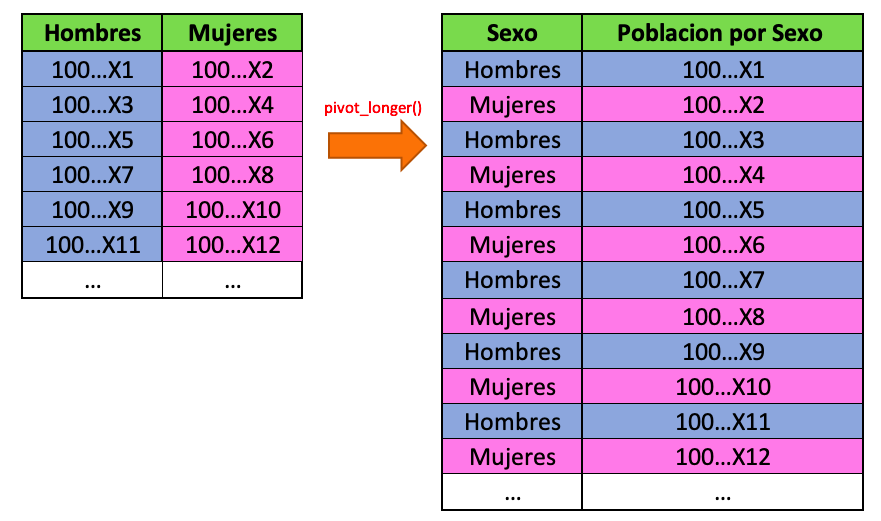

```{r setup, include=FALSE}
knitr::opts_chunk$set(echo = TRUE)
knitr::opts_chunk$set(fig.width=12, fig.height=8) 
```

Las pirámides de población (o _pirámide demográfica_, como le dicen los demógrafos) son un tipo de gráfica que nos permite analizar la distribución de la población por edades en una región determinada (municipio, estado o país).

Desde el punto de vista gráfico, se trata de un doble histograma de frecuencias, dispuestos de manera horizontal, donde convencionalmente **se ponen los grupos de edad masculina a la izquierda y los de poblaciòn femenina a la derecha**. En el eje _y_ (el de las ordenadas o el que va para arriba) se disponen los grupos de edad, moentras que en el eje _x_ (el de las ordenadas, o el que va horizontal) van las cantidades de población. Para más información recomiendo leer este artículo de [Wikipedia](https://es.wikipedia.org/wiki/Pirámide_de_población). 

Desde el punto de vista de visualización de datos en R y a pesar de la gran utilidad y amplio uso de este tipo de gráficas, no hay una función `geom_popPyramid()` nativa en `ggplot2` que nos permita hacer pirámides de población sin tanto dolor (aunque podríamos programarla 😏). Sin embargo, en esta entrada de blog, nos dispondremos a generar una de estas gráficas a partir de elementos ya conocidos de esta librería. 

## 1. Antecedentes. 

El viernes pasado estaba intentando hacer una de estas gráficas de población en mi trabajo, siendo (como casi siempre) mi primer impulso buscar en Google _"como graficar pirámides de población en R"_. Estos son algunos de los tutoriales y artículos que me ayudaron: 

* http://r-statistics.co/Top50-Ggplot2-Visualizations-MasterList-R-Code.html

* https://klein.uk/teaching/viz/datavis-pyramids/

* https://stackoverflow.com/questions/38268741/geom-bar-ggplot2-stacked-grouped-bar-plot-with-positive-and-negative-values-p

* https://stackoverflow.com/questions/4559229/drawing-pyramid-plot-using-r-and-ggplot2

Todos son muy buenos y sirven para complementar esta entrada. El problema que tuve al checarlos fué que 1) muchas funciones no estaban actualizadas y 2) las bases de datos eran inaccesibles, por lo que era imposible reproducir los ejemplos presentados. Es por eso que aquí presentamos una tercera opción (y en español :3) para aquellos que tengan la necesidad de hacer una gráfica de población en el futuro. 

# 2. Descripción del problema. 

Vamos a elaborar la pirámide de población del Estado de Morelos, México a partir de los datos reportados por la _Encuensta Intercensal 2015_ del INEGI en sus tabulados de Población. 

## 2.1. Descarga de los datos. 

Descargamos los datos de población de la página de la encuesta intercensal 2015. 

La liga de descarga es la siguiente: 

https://www.inegi.org.mx/contenidos/programas/intercensal/2015/tabulados/01_poblacion_mor.xls

(En caso de que algún gobierno austero decida eliminar las bases de datos de INEGI por algún motivo en los próximos años, igualmente guardaré una copia en mi Github de los datos).

_**Nota 1.** Se supone que el lector sabe descargar librerias del CRAN._ 

```{r}
# Descarga de los datos.
library(curl)
library(readxl)

curl::curl_download(url = "https://www.inegi.org.mx/contenidos/programas/intercensal/2015/tabulados/01_poblacion_mor.xls", destfile = "mor_pop.xls")

# Leemos datos
# Por tamaño de localidad
bd <- read_xls("mor_pop.xls", sheet = 2, skip = 6)
```

La función anterior descargará el archivo en nuestro directorio de trabajo. La hoja 2 es la que contiene la población _Por tamaño de localidad_ y las 6 líneas que se saltaron contienen el encabezado de logotipos que INEGI le pone a muchas de sus tablas. 

## 2.2. Procesado de la información. 

Necesitamos obtener una tabla adecuada para realizar nuestra gráfica, tal como se explica en el siguiente esquema: 


Este esquema nos permite declarar una columna única de una sola base de datos, y declarar estas columnas dentro de los estéticos globales del ggplot como se ve más adelante.

Para lograr esto, haremos el siguiente procesado de la información a través de la función `tidyr::pivot_longer()`: 


 

```{r, message=FALSE, cache=FALSE, warning=FALSE}
# Librerias
library(tidyverse)
library(tidyr)

# Procesamos datos
pop <- bd %>%
# Filtramos los renglones vacios, 
# los renglones donde el Tamaño de localidad` es el Total y 
# los `Grupos quinquenales de edad` son todos "Total"    
  filter(!is.na(Estimador) &
           Estimador == "Valor" &
           `Tamaño de localidad` == "Total" &
           `Grupos quinquenales de edad` != "Total") %>%
# Hacemos pivot longer rotando las columnas hombres y mujeres    
  pivot_longer(cols = c("Hombres", "Mujeres"),
               names_to = "Sexo",
               values_to = "Poblacion por Sexo") %>% 
# Nos quedamos con columnas utiles  
  select(`Entidad federativa`, `Grupos quinquenales de edad`, 
         `Población total`, Sexo, `Poblacion por Sexo`)

```

```{r, eval = FALSE}
# Checamos la base 
pop
```

```{r, eval = TRUE, echo = FALSE}
# Checamos la base 
pop %>% 
  DT::datatable(options = list(
  language = list(url = '//cdn.datatables.net/plug-ins/1.10.11/i18n/Spanish.json'),
  pageLength = 5))
```


Ahora que tenemos la base como la necesitamos, procedemos a hacer la gráfica. 

## 2.3. Graficando con `ggplot()`.

Para graficar utilizamos la función `ggplot()`.

## Primera versión: utilizando `geom_bar()`.

La primera versión que realizaremos será utilizando la función `geom_bar()`. Esta función nos permite realizar gráficas de barras en R. 

```{r}
### Grafica ----
ggplot(pop, aes(x = `Grupos quinquenales de edad`,
                y = `Poblacion por Sexo`,
                fill = Sexo)) +
  geom_col(data = subset(pop, Sexo == "Hombres") %>% 
             mutate(`Poblacion por Sexo` = -`Poblacion por Sexo`),
              width = 0.5, fill = "blue") +
  geom_col(data = subset(pop, Sexo == "Mujeres"),
           width = 0.5, fill = "pink") + 
  coord_flip()

```


<b style = 'color:red; text-align:center;'>Nótese las escalas del eje _x_</b>

Ahora, tenemos que enfocarnos en la parte del eje de población. Primero que nada, tenemos que hacer un poco de análisis. 

```{r}

# Valores maximos de población: 
max(pop$`Poblacion por Sexo`)
```

El máximo de población es 88,967 personas (correspondiente a Mujeres morelenses entre 20 a 24 años). Para el eje `x`, vamos a poner escalas cada 20,000 personas (para que sean unas 5 marcas en las escalas). 

```{r}
# BREAKS - DEFINEN LA POSICIÓN 
# Obtenemos los puntos donde se van a poner las escalas de la población. 
seq(0, 100000, by = 20000)
seq(-100000, -20000, by = 20000)

# Secuencia de puntos donde se van a poner las escalas del eje x
c(seq(-100000, -20000, by = 20000), seq(0, 100000, by = 20000))

```

Como vemos arriba, es una secuencia que va desde -100,000 hasta 100,000. Esto implica que, dentro de la gráfica, `ggplot()` va a poner las etiquetas en los puntos marcados arriba, como puede verse en la siguiente imágen: 

**Imágen de donde se van a marcar las etiquetas**.

Ahora, pongamosle las etiquetas en los puntos que determinamos arriba, a través de la función 

```{r}
# LABELS - DEFINEN EL CONTENIDO

c(seq(-100000, -20000, by = 20000) * -1, seq(0, 100000, by = 20000)) 

```

Para este caso, las etiquetas son casi iguales que los quiebres que calculamos arriba, con la diferencia de que la parte de la población masculina tienen que ser positivos, no negativos (por eso los multiplicamos por -1). 

Ahora, incorporamos esto en la gráfica que ya hicimos arriba a través de la función `scale_y_continuous()`.

Empezamos declarando los elementos estéticos. Los estéticos globales que vamos a usar son el `x`, el `y`, y el `fill`. `x` nos determinará la variable categórica que irá en el eje x, `y` la variable numérica que irá en el eje `y` y `fill` la variable categórica que clasifica a los datos en dos categorías, `Hombres` y `Mujeres`, asignando un color distinto a cada tipo de dato. 

```{r, eval = FALSE}
# No correr! Abajo está completo.
ggplot(pop, aes(x = `Grupos quinquenales de edad`,
                y = `Poblacion por Sexo`,
                fill = Sexo))
```

Después añadimos las gráficas de columnas mediante la función `geom_col()` con subconjuntos de los datos filtrando por hombres y mujeres. Después hacemos un cambio de ejes y al final añadimos las etiquetas en los ejes de las gráficas. A continuación el código completo. 

```{r}
### Grafica ----
(plt <- ggplot(pop, aes(x = `Grupos quinquenales de edad`,
                y = `Poblacion por Sexo`,
                fill = Sexo)) +
  # Seccion de HOMBRES
  geom_col(data = subset(pop, Sexo == "Hombres") %>% 
             # Convertimos los datos de los Hombres en negativos
             mutate(`Poblacion por Sexo` = -`Poblacion por Sexo`),
         width = 0.5, fill = "blue") +
  # Seccion de MUJERES
  geom_col(data = subset(pop, Sexo == "Mujeres"),
         width = 0.5, fill = "pink") + 
  # Cambio de ejes de coordenadas
  coord_flip() + 
     scale_y_continuous(
     breaks = c(seq(-100000, -20000, by = 20000), seq(0, 100000, by = 20000)),
     labels = c(seq(-100000, -20000, by = 20000) * -1, seq(0, 100000, by = 20000))) )

```

Ya a partir de aquí lo que procede es personalizar el tema y las etiquetas. 

## 2.4. Se puede graficar en plotly

R: Si. Este tipo de gráficas se pueden traducir a `plotly`, quedando como se ve a continuación. 

```{r, echo=FALSE,fig.width=8}
plotly::ggplotly(plt)
```

## 2.5. Segunda versión: utilizando `geom_linerange()`.

Otra versión muy común de las gráficas de pirámides de población consiste en poner los grupos de edad en el centro de la gráfica. Esto no es posible de realizar con las barras normales de `ggplot`, por lo que utilizaremos un elemento gráfico llamado `geom_linerange()`, el cual nos permite representar de manera gráfica intervalos con inicio y final. 

La única diferencia entre el metodo anterior y el que viene a continuación, consiste en 1) Cambiar el `geom_col()` por un `geom_linerange()`, incluir dentro el `aes(ymin, ymax)` y 3) también introducir como etiquetas de texto en el centro de la gráfica con `geom_label()`.

Igualmente, hay que programar un `desplazamiento` de las barras a la derecha y a la izquierda, para dejar el espacio para las etiquetas que van a ir en el centro. Para la gráfica que queremos hacer dejaremos un desplazamiento de 10,000 unidades de población (la magnitud de este desplazamiento depende de los datos del eje _y_, en este caso de los números de población). 

Se escogió 10,000 como desplazamiento porque así cabe bien el texto de las categorias de edad. 

```{r}
### Grafica ----
desplazamiento <- 10000
```

Para este caso modificaremos ligeramente las etiquetas: 

```{r}
# BREAKS
c(seq(-180000, 0, by = 30000) - desplazamiento,
                seq(0, 180000, by = 30000) + desplazamiento)
```

Estas serán las nuevas coordenadas dentro del eje X en las que se van a colocar las nuevas etiquetas. Es lo mismo que con las anteriores, solo que sumandole/restándole el desplazamiento. 

```{r}
# LABELS
c(rev(seq(0, 180000, by = 30000)), seq(0, 180000, by = 30000))

```

Ahora si, hacemos la gráfica: 

```{r}
# Graficamos
ggplot(pop, aes(x = `Grupos quinquenales de edad`,
                y = `Poblacion por Sexo`,
                fill = Sexo)) +
  geom_linerange(data = subset(pop, Sexo == "Hombres") %>% 
                   # Convertimos los datos de los Hombres en negativos
                 mutate(`Poblacion por Sexo` = -`Poblacion por Sexo`),
                 aes(ymin = -desplazamiento, 
                     ymax = -desplazamiento +`Poblacion por Sexo`),
                 size = 5, 
                 color = "blue") +
  geom_linerange(data = subset(pop, Sexo == "Mujeres"),
                 aes(ymin = desplazamiento, 
                     ymax = desplazamiento  +`Poblacion por Sexo`),
                 size = 5, 
                 color = "pink") +
  # Cambiamos el orden de los ejes de la graficas 
  coord_flip()  +
   scale_y_continuous(
     breaks = c(seq(-180000, 0, by = 30000) - desplazamiento,
                seq(0, 180000, by = 30000) + desplazamiento),
     labels = c(rev(seq(0, 180000, by = 30000)),
               seq(0, 180000, by = 30000))) +
  # Eliminamos el texto del eje x volteado
   theme(plot.title = element_text(hjust = .5),
        axis.ticks = element_blank(),
        axis.text.y = element_blank()
        ) +   # Centre plot title
   # Aniadimos la escala de texto en el centro. 
   geom_label(aes(x = `Grupos quinquenales de edad`, 
                  y = 0, 
                  label = `Grupos quinquenales de edad`),
   # Caracteristicas del texto             
             family = "Arial",
             size = 3.5, 
             label.padding = unit(0.0, "lines"), 
             label.size = 0,
             label.r = unit(0.0, "lines"), 
             fill = "#FFFFFF", 
             alpha = 0.9, 
             color = "#5D646F")
```

## 2.6. Qué sigue? 

Lo que sigue a continuación es embellecer la gráfica modificando los temas: fondo de la gráfica, tipo de letra, colores, etc. Igualmente, añadir formato a los números, poner títulos, subtítulos y pies de página, modificar los colores (quizá el rosa para mujeres y azul para hombres no parezca tan adecuado), entre alguna otra función añadida que nos interese agregar. 

Una de las ventajas de hacer visualizaciones en código es que es difícil solo la primera vez. Una vez que ya tenemos el código, podemos tenerlo guardado para hacer otras gráficas cuando salgan nuevos datos de población (alguien dijo censo 2020?) o que podemos utilizarlo para graficar otros datos (por ejemplo, pirámides para municipios dentro de un estado o de otros estados, o por tamaños de comunidad). O ya de plano construir una aplicación en _Shiny_ para que el usuario haga las pirámides de población que quiera. 

