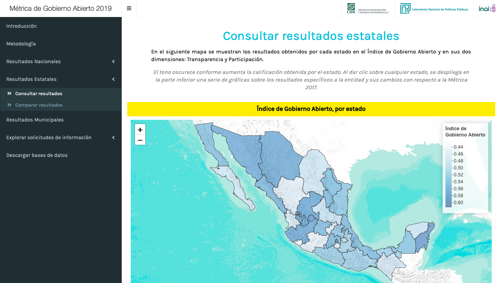
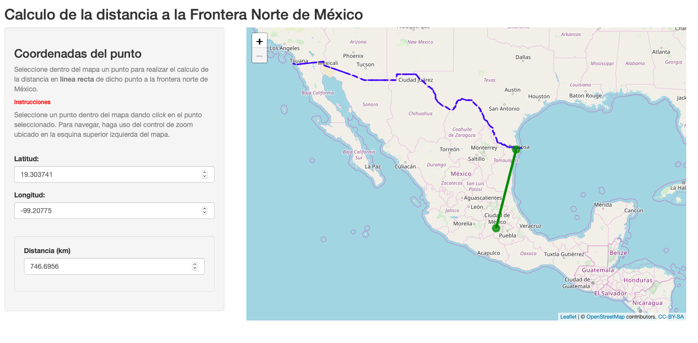

```{r setup, include=FALSE}
knitr::opts_chunk$set(echo = TRUE)
```

**¿Qué es shiny?**

La librería `{shiny}` es un paquete de R que nos permite realizar aplicaciones web interactivas a partir de utilizar funciones en el lenguaje R. Al igual que otros paquetes de este lenguaje de programación, como `dplyr` o `ggplot`, para usar shiny tenemos que instalarlo desde el CRAN y llamarlo en nuestra sesión de R. Tan simple como eso. 

Shiny es altamente versatil y nos permite hacer páginas web funcionales sin la necesidad de aprender el lenguaje HTML ni las hojas de estilo CSS, lo cual lo hace muy práctico para muchos perfiles de analistas que deseen publicar su trabajo o explorar ideas y que no tienen los recursos para contratar un programador, o que deséen hacerlo por su cuenta. 

Esta es la primera **entrada de blog** que elaboraré respecto al tema. Primero que nada, deseo mostrar **¿Qué se puede hacer con esta librería?**

## Ejemplos de lo que se puede hacer con shiny 

1. **Métrica de gobierno abierto, 2019**

https://lnppmicrositio.shinyapps.io/metricadegobiernoabierto2019/




Página donde se muestran los resultados del estudio de la Métrica de Gobierno Abierto, realizado en 2018 por el CIDE. Esta aplicación es un tablero que complementa a los entregables impresos, que a su vez funciona como un repositorio de datos, de archivos, explicación de la metodología y sistema de consulta interactivo.

2. **Distancia punto a línea**

https://juvenalcampos.com/2020/02/18/distancia-punto-a-linea/




En esta entrada de blog se incluye al final una aplicación shiny, la cual se construye a partir de una función previamente programada para calcular la distancia de un punto del mapa hasta el punto más cercano a la frontera con U.S.. Hacer el shiny permite que cualquier persona pueda calcular este punto y esta distancia, sin saber absolutamente nada de programación en R.

3. **Ecobici (Datatón)**

https://lnppmicrositio.shinyapps.io/ecobiciDataton/


Esta aplicación fué una entrada para el Datatón de Visualización de datos de ecobici del CIMAT. Su realización fué un trabajo conjunto entre analistas que usaron Python y R para el análisis de datos, comunicando los resultados a la aplicación a través de una API. 

4. **Exploración de la Red de Caminos Nacional**

https://lnppmicrositio.shinyapps.io/redCaminosShiny/


Aplicación para explorar la Red Nacional de Caminos de INEGI, filtrandola a nivel estado. 


## Apps de otros autores. 

1. **Parámetros de la función binomial.** 

https://segasi.shinyapps.io/binomial/


En esta aplicación, @segasi juega a experimentar los cambios en los parámetros de una variable que distribuye binomial. 

2. **Shiny apps for introductory statistics.** 

https://github.com/ShinyEd/intro-stats


En este repositorio, @minebocek crea aplicaciones escritas con shiny para la enseñanza de estadística introductoria a través de simulación computacional.

3. **In Review: Your 2019 on Twitter**

https://gadenbuie.shinyapps.io/tweets-of-2019/


En esta aplicación, @gadenbuie crea una aplicación para poder explorar nuestra actividad en Twitter de manera rápida: nos brinda datos sobre nuestros Tweets más seguidos y las personas con las que más interactuamos. 

4. **Coronavirus Tracker**

https://shiny.john-coene.com/coronavirus/


En esta aplicación, se monitorizan los datos de infección del _coronavirus_ en tiempo real a partir de datos de la John Hopkins. 

5. **Wes Anderson Actor Network**

https://committedtotape.shinyapps.io/wesandersonnetwork/


En esta aplicación, @committedtotape nos muestra las relaciones entre actores que han participado en la filmografía de Wes Anderson.

### Galerías de aplicaciones Shiny

Igualmente, existen varias galerías de aplicaciones hechas en Shiny, por ejemplo, las siguientes: 

* https://shiny.rstudio.com/gallery/

* https://twitter.com/ShinyappsRecent

* http://showmeshiny.com

Las cuales son un punto para tomar inspiración, ideas (y código) para poder realizar nuestras propias aplicaciones web. 

Esta es la primera entrada de blog sobre shiny. Planeo escribir un par más de ellas: uno donde se ahonde más sobre la naturaleza de la paquetería y otro explicando las funcionalidades y el tipo de usuario que podría sacarle más provecho. 

Hasta la próxima. 

**Juvenal Campos.** 

